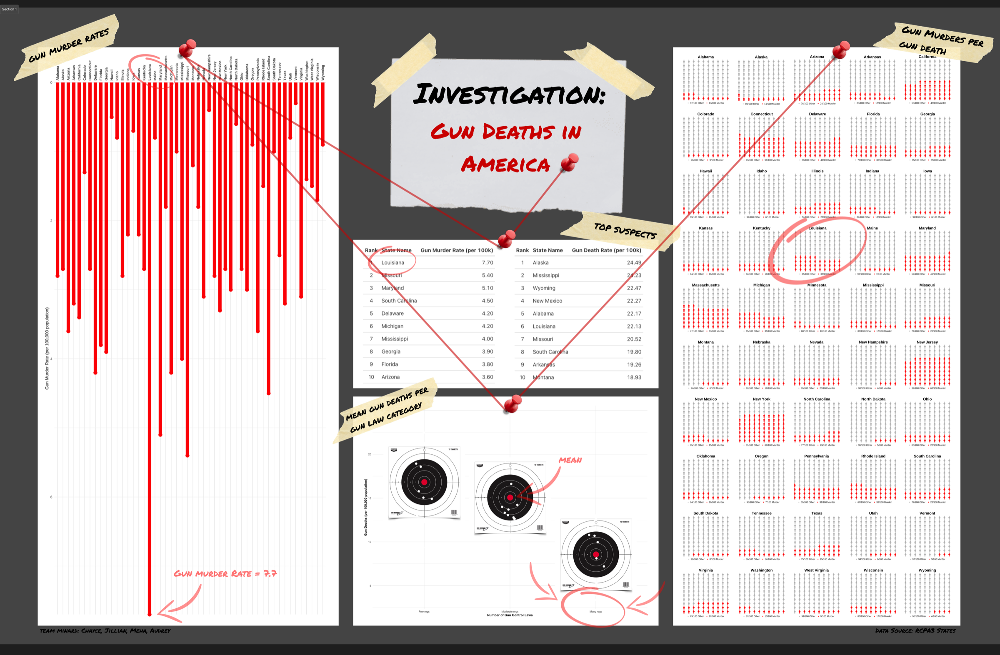
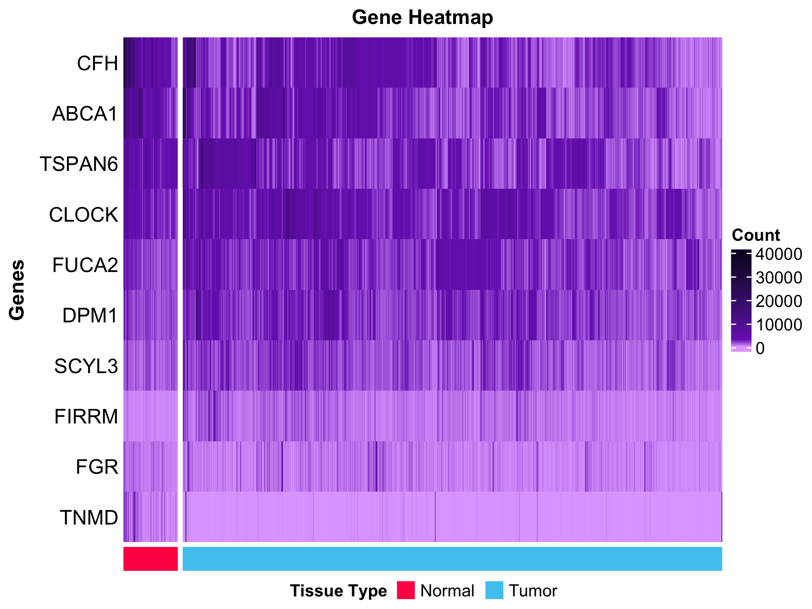

# MSHDS Repository

This repository collects some of my work and projects for the **Master of Science in Health Data Science (MSHDS)** program.  

---

## Highlights

Click any image to explore the project.

<div align="center">

| | | |
|:---:|:---:|:---:|
| [](https://medicaid-map.com) | [](gun-deaths/) | [](rna-seq/) |
| **Medicaid Expansion**<br>Website: [medicaid-map.com](https://medicaid-map.com) | **Gun Deaths**<br>State-level exploratory analysis | **RNA-seq**<br>[Knitted report](https://htmlpreview.github.io/?https://github.com/chaycereed/mshds/blob/main/rna-seq/rna-seq.html) |

</div>

---

## Repository Structure

```text
.
├── gun-deaths/
│   ├── gun_deaths_analysis.qmd
│   └── gun_deaths_poster.png
├── medicaid-expansion/
│   ├── exploratory/
│   │   ├── acs_dashboard.Rmd
│   │   ├── acs_eda.Rmd
│   │   └── meps_eda.Rmd
│   ├── medicaid-dashboard/
│   │   ├── medicaid_dashboard.R
│   │   ├── medicaid-dashboard.Rproj
│   │   └── data/            # prebuilt .rds inputs (not included in repo)
│   └── production/
│       ├── medicaid-map.qmd
│       └── medicaid-expansion-poster.pdf
├── rna-seq/
│   ├── rna-seq.rmd
│   ├── rna-seq.html
│   ├── data/               # input CSVs (not included in repo)
│   ├── figures/
│   └── README.md
├── socioeconomic-disease/
│   └── ses_chronic_disease.Rmd
└── README.md
```

---

## gun-deaths/

A hackathon-style exploratory analysis of state-level gun death data using the `RCPA3` `states` dataset.

Contents include:

- `gun_deaths_analysis.qmd` — Quarto source notebook
- `gun_deaths_poster.png` — exported summary poster

---

## medicaid-expansion/

An applied research project examining the effects of Medicaid expansion on insurance coverage and
financial burden across U.S. states, drawing on ACS and MEPS data. The work is organized into
exploratory, production, and dashboard stages.

### exploratory/

Early exploratory data analysis and prototyping:

- `acs_eda.Rmd` — American Community Survey (ACS) exploratory analysis
- `meps_eda.Rmd` — Medical Expenditure Panel Survey (MEPS) exploratory analysis
- `acs_dashboard.Rmd` — ACS dashboard prototype

### production/

Polished, presentation-ready outputs:

- `medicaid-map.qmd` — final visualizations, including a custom Medicaid theme, choropleth maps,
  difference-in-differences (DiD) modeling, ranking tables, and personographs
- `medicaid-expansion-poster.pdf` — final research poster

### medicaid-dashboard/

A Shiny application deployed to shinyapps.io:

- `medicaid_dashboard.R` — Shiny `app.R` source
- `medicaid-dashboard.Rproj` — RStudio project file
- `data/` — prebuilt `.rds` inputs the app loads (`map_summary`, `fpl_coverage_df`, `avg_df`; not included in repo)

---

## rna-seq/

A complete RNA-seq analysis workflow developed as part of coursework.

A compact RNA-seq workflow demonstrating:

- data import and preprocessing  
- summarizing gene metadata  
- exploratory visualization  
- gene-level comparisons across biological groups  
- heatmaps and formatted tables  

Contents include:

- `rna-seq.rmd` — source notebook  
- `rna-seq.html` — knitted, viewable analysis  
- `data/` — input CSVs (not included in repo)  
- `figures/` — exported plots  
- `README.md` — instructions and description

---

## socioeconomic-disease/

An analysis of socioeconomic disparities in chronic disease prevalence among U.S. adults, using NHANES
data to examine how socioeconomic status relates to the likelihood of obesity.

Contents include:

- `ses_chronic_disease.Rmd` — source notebook

---

## Data Policy

Raw datasets used in coursework are **not included** in the repository.  
Users must provide their own `data/` directory when running analyses locally.

Each project folder contains instructions for where data originates and how to structure the local directory.

---

## Reproducibility

Every analysis project includes:

- a reproducible `.Rmd` or `.qmd` notebook  
- a knitted HTML file for immediate viewing  
- consistent directory structure  
- session information  
- exported figures  
- clear instructions for re-running the workflow  

This ensures that each assignment, analysis, or demonstration is transparent, reproducible, and self-contained.
</content>
</invoke>
