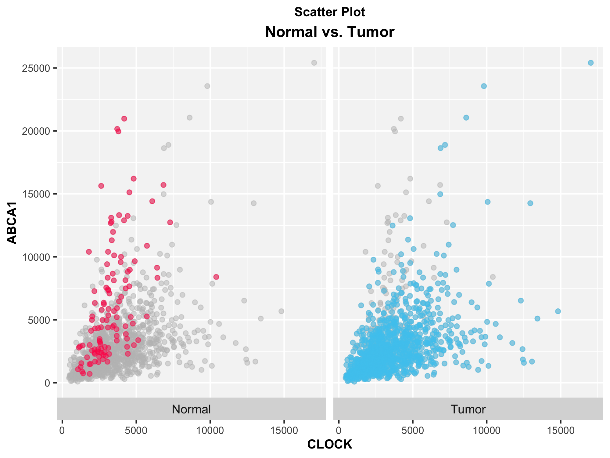

# RNA-seq Analysis Demo

This folder contains a clean, self-contained RNA-seq analysis workflow using count data and sample metadata.  
The notebook demonstrates data import, preprocessing, summary statistics, exploratory visualization, and gene-level expression comparisons across biological groups.



---

## Contents

- **rna-seq.Rmd** — main analysis notebook  
- **rna-seq.html** — rendered analysis (plots, heatmaps, tables)  
- **data/** — input data (`counts.csv`, `meta_data.csv`)  
- **figures/** — exported figures generated by the notebook  
- **README.md** — this file

---

## View the Analysis

Open the rendered HTML notebook:

**`rna-seq.html`**

If GitHub does not display it directly, click **Raw** or **Download** to view the file.

---

## ▶️ Running the Notebook Yourself

1. Place your RNA-seq files inside a `data/` folder:  
   - `counts.csv` — raw count matrix (genes × samples)  
   - `meta_data.csv` — sample metadata  

2. Confirm the paths at the top of the Rmd:

```r
filepath <- "./data/"
metadata <- read.csv(file.path(filepath, "meta_data.csv"), row.names = 1, check.names = FALSE)
counts   <- read.csv(file.path(filepath, "counts.csv"), row.names = 1, check.names = FALSE)
```

3. Install required R packages:

```r
install.packages(c("ggplot2", "ggbeeswarm"))
BiocManager::install(c("biomaRt", "ComplexHeatmap", "circlize"))
```

4. Knit `rna-seq.Rmd` to HTML.

---

## Data

Raw RNA-seq data is **not included** in this repository.  
Provide your own count matrix and metadata file in the expected format.
